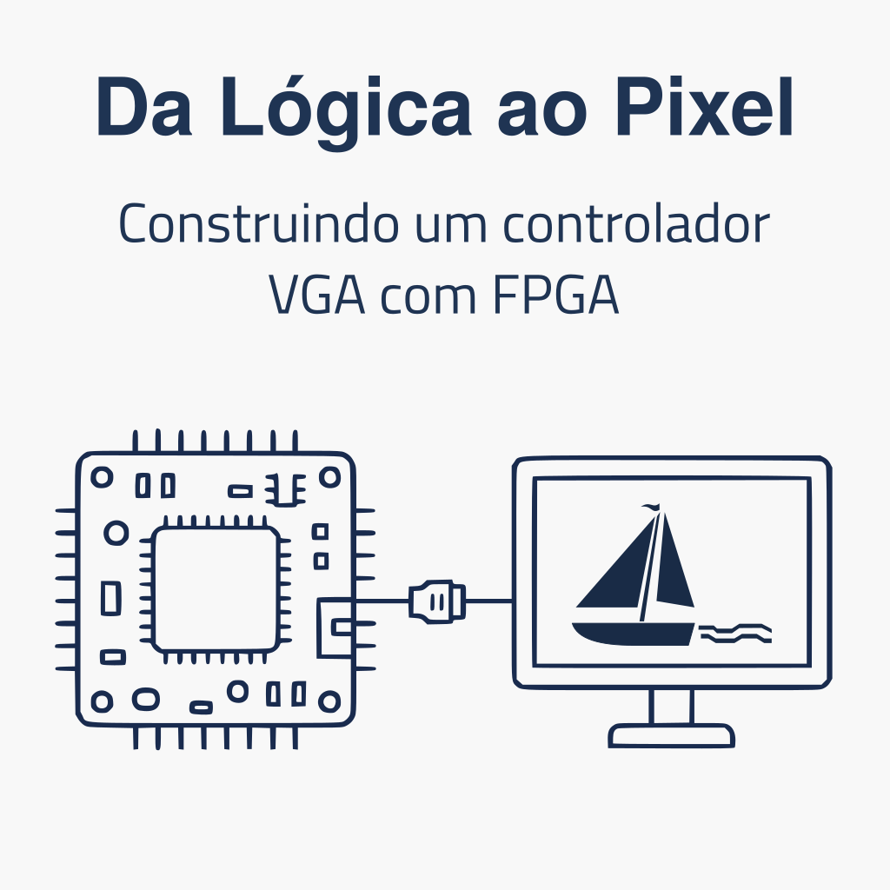

# Da Lógica ao Pixel: Construindo um Controlador VGA com FPGA

Nesta oficina, os participantes irão explorar o uso de FPGAs e linguagens de descrição de hardware (HDL) para construir, do zero, um controlador VGA funcional. Ao final da atividade, serão capazes de gerar sinais VGA e exibir imagens ou animações em um monitor.